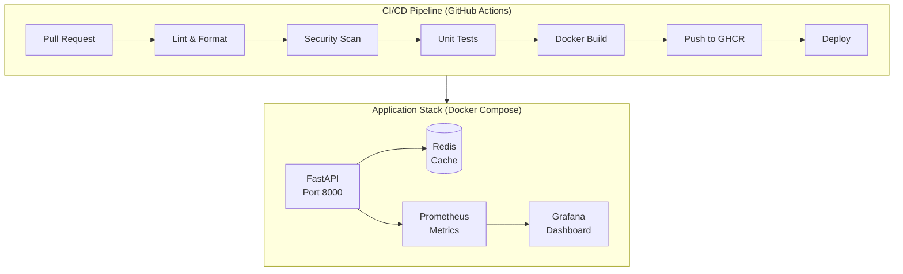
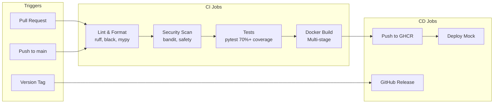

# FastAPI Deployment Pipeline

[](https://github.com/eurysohn/fastapi-deployment-pipeline/actions/workflows/ci.yml)
[](https://github.com/eurysohn/fastapi-deployment-pipeline/actions/workflows/security.yml)
[](https://opensource.org/licenses/MIT)
[](https://www.python.org/downloads/)

**Production-ready FastAPI deployment pipeline demonstrating DevOps best practices.**

This repository serves as a reference implementation for building, testing, and deploying FastAPI applications with enterprise-grade CI/CD pipelines, observability, and security practices.

---

## Architecture Overview



### System Components

| Component | Purpose | Technology |
|-----------|---------|------------|
| **API Server** | REST API with health checks & metrics | FastAPI, Uvicorn |
| **Cache Layer** | Response caching, session store | Redis |
| **Metrics** | Time-series metrics collection | Prometheus |
| **Dashboard** | Visualization & alerting | Grafana |
| **CI/CD** | Automated testing & deployment | GitHub Actions |

---

## Project Structure

```
fastapi-deployment-pipeline/
│
├── 📁 app/                       # Application source code
│   ├── 📁 api/                   # API endpoints
│   │   ├── health.py             # /healthz, /readyz endpoints
│   │   ├── metrics.py            # /metrics (Prometheus)
│   │   └── 📁 v1/                # API version 1
│   │       └── items.py          # CRUD operations
│   ├── 📁 core/                  # Core modules
│   │   ├── config.py             # Pydantic settings
│   │   └── logging.py            # Structured logging
│   ├── 📁 middleware/            # Custom middleware
│   │   └── request_id.py         # Request tracing
│   ├── 📁 services/              # Business logic
│   │   └── cache.py              # Redis service
│   └── main.py                   # App entry point
│
├── 📁 tests/                     # Test suite (pytest)
│   ├── conftest.py               # Fixtures
│   ├── test_health.py
│   ├── test_metrics.py
│   └── test_items.py
│
├── 📁 .github/                   # GitHub configuration
│   ├── 📁 workflows/             # CI/CD pipelines
│   │   ├── ci.yml                # Main CI pipeline
│   │   ├── release.yml           # Release automation
│   │   └── security.yml          # Security scanning
│   ├── 📁 ISSUE_TEMPLATE/        # Issue templates
│   └── dependabot.yml            # Dependency updates
│
├── 📁 monitoring/                # Observability
│   ├── 📁 prometheus/            # Prometheus config
│   └── 📁 grafana/               # Dashboards
│
├── 📁 load_tests/                # Performance testing
│   └── locustfile.py             # Load test scenarios
│
├── 📁 docs/                      # Documentation
│   ├── 📁 architecture/          # ADRs
│   └── runbook.md                # Operations guide
│
├── Dockerfile                    # Multi-stage build
├── docker-compose.yml            # Full stack
├── Makefile                      # Developer commands
├── requirements.txt              # Production deps
└── requirements-dev.txt          # Development deps
```

---

## Quick Start

### Prerequisites

- **Docker & Docker Compose** - For running the full stack
- **Python 3.9+** - For local development
- **Make** (optional) - For convenience commands

### Option 1: Docker Compose (Recommended)

```bash
# Clone the repository
git clone https://github.com/eurysohn/fastapi-deployment-pipeline.git
cd fastapi-deployment-pipeline

# Start all services
docker-compose up -d

# Check status
docker-compose ps

# View logs
docker-compose logs -f api

# Stop services
docker-compose down
```

After starting, access the services:
- **API Documentation**: Open your browser to `http://localhost:8000/docs`
- **Prometheus**: `http://localhost:9090`
- **Grafana**: `http://localhost:3000` (login: admin/admin)

### Option 2: Local Development

```bash
# Clone and enter directory
git clone https://github.com/eurysohn/fastapi-deployment-pipeline.git
cd fastapi-deployment-pipeline

# Create virtual environment
python3 -m venv .venv
source .venv/bin/activate  # Windows: .venv\Scripts\activate

# Install dependencies
pip install -r requirements-dev.txt

# Run tests
pytest tests/ -v

# Start the API (without Redis)
uvicorn app.main:app --reload --port 8000
```

---

## CI/CD Pipeline



### Pipeline Stages

| Stage | Tools | Description |
|-------|-------|-------------|
| **Lint** | Ruff, Black, MyPy | Code quality & type checking |
| **Security** | Bandit, Safety, Trivy | SAST & dependency scanning |
| **Test** | Pytest | Unit tests with 70% coverage threshold |
| **Build** | Docker | Multi-stage production image |
| **Push** | GHCR | GitHub Container Registry |
| **Deploy** | Mock | Deployment simulation |

---

## API Endpoints

| Endpoint | Method | Description |
|----------|--------|-------------|
| `/` | GET | Service info |
| `/healthz` | GET | Liveness probe (Kubernetes) |
| `/readyz` | GET | Readiness probe (Kubernetes) |
| `/health` | GET | Detailed health check |
| `/metrics` | GET | Prometheus metrics |
| `/docs` | GET | Swagger UI documentation |
| `/api/v1/items` | GET | List items (paginated) |
| `/api/v1/items` | POST | Create item |
| `/api/v1/items/{id}` | GET | Get item by ID |
| `/api/v1/items/{id}` | PUT | Update item |
| `/api/v1/items/{id}` | DELETE | Delete item |

---

## Key Features

### Observability
- **Structured JSON Logging** - ELK/CloudWatch compatible
- **Request ID Tracing** - Distributed tracing support
- **Prometheus Metrics** - Request rate, latency, errors
- **Grafana Dashboards** - Pre-configured visualizations

### Security
- **Non-root Container** - Principle of least privilege
- **SAST Scanning** - Static analysis with Bandit
- **Dependency Audit** - Vulnerability scanning with Safety
- **Container Scanning** - Trivy integration
- **Secret Detection** - Gitleaks in CI

### Developer Experience
- **Makefile** - Common commands (`make test`, `make run`)
- **Pre-commit Hooks** - Automatic code quality checks
- **Hot Reload** - Fast development iteration
- **Comprehensive Tests** - 80%+ code coverage

---

## Available Commands

```bash
make help          # Show all available commands
make dev           # Install development dependencies
make test          # Run tests with coverage
make lint          # Run linters (ruff, mypy)
make format        # Auto-format code
make security      # Run security checks
make build         # Build Docker image
make docker-up     # Start all services
make docker-down   # Stop all services
make docker-logs   # Follow service logs
make load-test     # Run load tests (Locust)
make ci            # Run full CI pipeline locally
```

---

## Configuration

Environment variables (see `.env.example`):

| Variable | Description | Default |
|----------|-------------|---------|
| `ENVIRONMENT` | Runtime environment | `development` |
| `LOG_LEVEL` | Logging verbosity | `INFO` |
| `LOG_FORMAT` | Log format (`json`/`console`) | `json` |
| `REDIS_URL` | Redis connection string | `redis://redis:6379/0` |
| `METRICS_ENABLED` | Enable Prometheus metrics | `true` |

---

## Documentation

- [Architecture Decision Records](docs/architecture/) - Design decisions
- [Operations Runbook](docs/runbook.md) - Incident response guide
- [Contributing Guide](CONTRIBUTING.md) - How to contribute
- [Security Policy](SECURITY.md) - Vulnerability reporting
- [Changelog](CHANGELOG.md) - Version history

---

## DevOps Best Practices Demonstrated

| Practice | Implementation |
|----------|----------------|
| **Infrastructure as Code** | Dockerfile, docker-compose.yml |
| **CI/CD Automation** | GitHub Actions workflows |
| **Shift-Left Security** | Security scanning in CI |
| **Observability** | Metrics, logging, health checks |
| **GitOps Ready** | Container images, version tags |
| **Documentation** | ADRs, runbooks, API docs |

---

## License

MIT License - see [LICENSE](LICENSE) for details.

---

## Tech Stack


